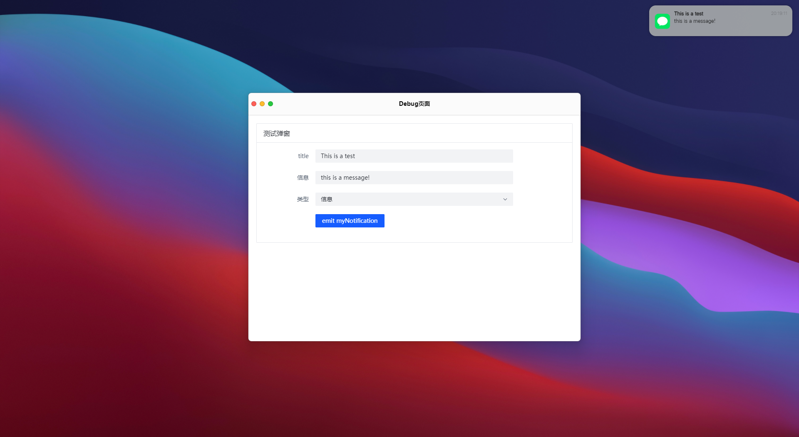
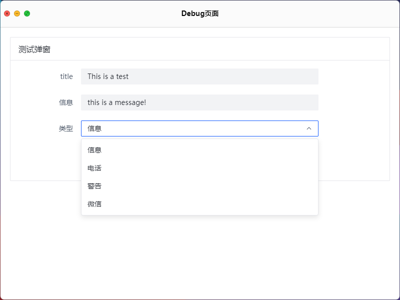
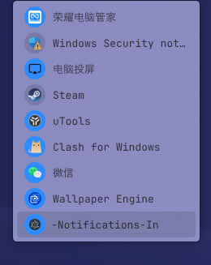

# Mac-Notification-In-Windows

Welcome to our Notification System project! This project is designed to showcase a Notification system similar to macOS Notification Center. It is built using Electron, Express, and Vue, providing a platform to display various types of notifications, such as information, calls, and reminders.

## Features

- Display various types of notifications
- Integration with iPhone Shortcuts for quick interactions
- Testing window for previewing and rendering test data
- Support for Electron Builder to package as .exe
- Customization and rendering of notifications by sending data to backend server URL (localhost:3000)

## Getting Started

1. Clone the repository:

```shell
git clone https://github.com/Wadehl/mac-notifications-in-windows.git
```

2. Install dependencies:

```shell
cd mac-notifications-in-windows
pnpm add
```
3. Start the application and backend server:
```shell
pnpm run dev
```

4. Access the application and explore the Notification System.

## Demo



